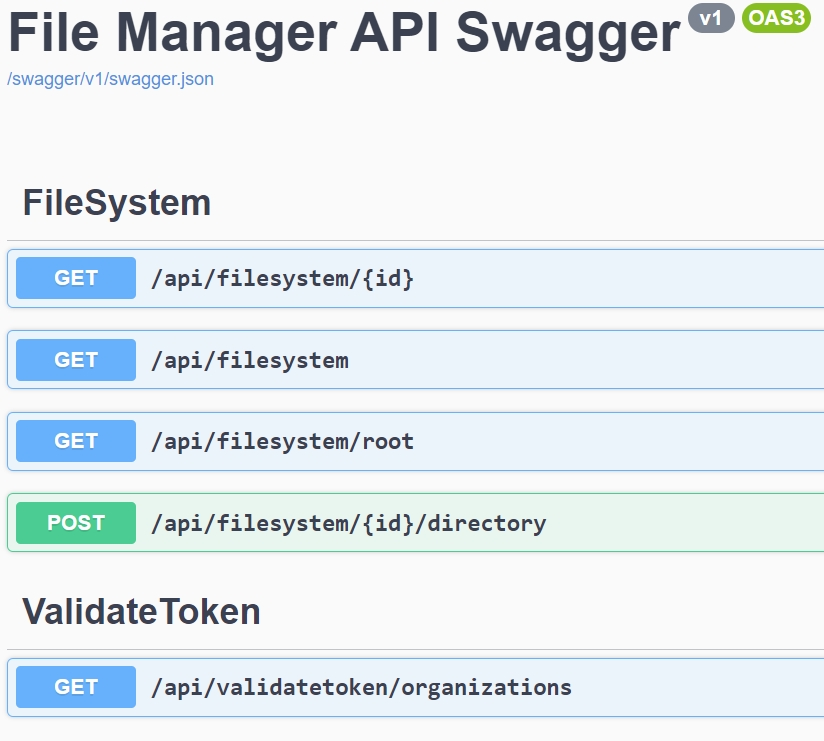

# Final

The project consists of 2 APIs: 1) Identity, 2) Virtual File Manager.

```docker-compose -f docker-compose.yml -f docker-compose.override.yml up --build```

- Identity https://localhost:7166/swagger/index.html
- File Manager https://localhost:7167/swagger/index.html

The identity service is a standalone service designed to authenticate a user to the platform. Applications on the platform could validate the user's ability to access the platform.

To support these services, the platform and applications are abstracted into multiple projects. The projects central to the platform are:
- Platform.Core
- Platform.Core.RestApi

These projects provide the overall structure for the platform. The platform is designed to support multiple applications. The strucuture is abstracted for services that are common to applications and then those abstractions that are common for projects developed that need specific compoinents arelated to web development for API and UI services.

- CogniVault.Platform.Identity
- CogniVault.Platform.Identity.EFCoreProvider
- CogniVault.Platform.Identity.InMemoryProvider


- CogniVault.Application.VirtualFileSystem
- CogniVault.Application.VirtualFileSystem.Provider


## Identity API
The application is designed to support the following features:
- Organization
- Tenants
- Interfaces
- Users

The hierarchy is as follows:
- Organization
    - Tenant
        - Interface
- User

A user can belong to multiple organizations.
The user can be assigned to multiple tenants.
The user can be assigned to multiple interfaces.
The user can be assigned to multiple roles. The user can be assigned to multiple permissions.


The API is currently using 2 data providers. The Organization/Tenant/Interface structure is backed by a SQlite instance. The User Token store is backed by an In-Memory Repository. The In-Memory Repository is used to store the user's token. The token is used to validate the user's identity. The token is used to validate the user's permissions.

## Virtual File Manager API
The application is designed to provide a secure file system to organizations that support various use cases. An organization can be divided into different tenants. This could be for billing or security related purposes. AN organization must have a globally unique name. A tenant must have a gloablly unique name. However, interfacing naming is unique to the tenant only.



### Docker-Compose
```bash
docker-compose -f docker-compose.yml -f docker-compose.override.yml up --build
```


### Seeding
Each API is seeded by implementing a Hosted Service.

When the Hosted Services are started they will acquire the necessary services:
```csharp
    public async Task StartAsync(CancellationToken cancellationToken)
    {
        using var scope = _serviceProvider.CreateScope();
        // Initialize services and assign them to properties
        UnitOfWork = scope.ServiceProvider.GetRequiredService<IUnitOfWork>();
        
        UsernameValidator = scope.ServiceProvider.GetRequiredService<IValidator<Username>>();
        PlainPasswordValidator = scope.ServiceProvider.GetRequiredService<IValidator<PlainPassword>>();
        PasswordEncryptor = scope.ServiceProvider.GetRequiredService<IPasswordEncryptor>();
        EmailValidator = scope.ServiceProvider.GetRequiredService<IValidator<Email>>();
        QuotaValidator = scope.ServiceProvider.GetRequiredService<IValidator<Quota>>();

        OrganizationNameValidator = scope.ServiceProvider.GetRequiredService<IValidator<OrganizationName>>();
        TenantNameValidator = scope.ServiceProvider.GetRequiredService<IValidator<TenantName>>();
        InterfaceNameValidator = scope.ServiceProvider.GetRequiredService<IValidator<InterfaceName>>();

        await SeedAdminUserAsync();
        await SeedUsersAsync();
    }
```

The Hosted Services use a Builder pattern to seed the data. The provided code snippet demonstrates the use of the Builder design pattern. Here's a breakdown of how the Builder pattern is applied:

PlatformTenantBuilder: This builder is responsible for constructing a Tenant object. The builder allows for a step-by-step construction of the Tenant object by setting its properties (like organization and tenant name) before finally building the object.

```csharp
var tenantBuilder = new PlatformTenantBuilder()
    .WithOrganization(org)
    .WithTenantName(tenantName);
var builtTenant = await tenantBuilder.BuildAsync();
```

PlatformInterfaceBuilder: This builder is responsible for constructing an Interface object. Similar to the PlatformTenantBuilder, it allows for a step-by-step construction of the Interface object by setting its properties (like tenant and interface name) before finally building the object.

```csharp
var productionInterfaceBuilder = new PlatformInterfaceBuilder()
    .WithTenant(builtTenant)
    .WithInterfaceName(productionInterfaceName);
await builtTenant.AddInterfaceAsync(await productionInterfaceBuilder.BuildAsync());
```

The Builder design pattern is particularly useful when an object needs to be created with many optional components or configurations. To seed the data with multiple tenants and multiple interfaces, random data is generated using the Bogus library.

```csharp
public PlatformTenantBuilder()
{
    _asyncTasks.Add(async () => await Task.Delay(1));
}

public PlatformTenantBuilder WithOrganization(PlatformOrganization organization)
{
    Organization = organization;
    _asyncTasks.Add(async () => await ValidateOrganizationAsync(Organization));
    return this;
}

public PlatformTenantBuilder WithTenantName(TenantName name)
{
    Name = name.Copy();
    _asyncTasks.Add(async () => await ValidateTenantNameAsync(Name));
    return this;
}

public async Task<PlatformTenantBuilder> AddInterfaceAsync(PlatformInterfaceBuilder interfaceBuilder)
{
    var platformInterface = await interfaceBuilder.BuildAsync();
    Interfaces.Add(platformInterface);
    return this;
}

public async Task<PlatformTenant> BuildAsync()
{
    foreach (var task in _asyncTasks)
    {
        await task();
    }

    var platformTenant = await PlatformTenant.CreateAsync(Organization, Name);

    return platformTenant;
}
```


### Entity Framework Core
EF is implemented to store the multi-tenant registrations using a Unit of Work pattern
```csharp
await _identityDbResolver.GetContext<PlatformOrganization>().InsertAsync(evaluatedOrganizations);
await _identityDbContext.SaveChangesAsync();
```


### Value Objects and Validation
The applications use Value Objects to represent data like names for organizations/tenants/interfaces/directory paths/file names, emails, and passwords. Each value object is supported with validation to ensure that necessary rules are enforced. The validation is implemented using FluentValidation.

```csharp
public class OrganizationName : IValueObject<OrganizationName>
{
    public string Value { get; set; }

    public OrganizationName(string value)
    {
        Value = value;
    }

    public static OrganizationName Null => new OrganizationName(string.Empty);

    public static async Task<OrganizationName> CreateAsync(string value, IValidator<OrganizationName> validator)
    {
        var instance = new OrganizationName(value);
        var results = await validator.ValidateAsync(instance);
        if (!results.IsValid)
        {
            throw new ValidationException(results.Errors);
        }
        return instance;
    }


    public int CompareTo(OrganizationName? other)
    {
        return Value.CompareTo(other?.Value);
    }

    public OrganizationName Copy()
    {
        return new OrganizationName(Value);
    }

    public bool Equals(OrganizationName? other)
    {
        return Value == other?.Value;
    }

    public override int GetHashCode()
    {
        return Value.GetHashCode();
    }

    public override string ToString()
    {
        return Value;
    }

    public static explicit operator OrganizationName(string? v)
    {
        if (v == null)
        {
            throw new ArgumentNullException(nameof(v), "The input string cannot be null.");
        }

        return new OrganizationName(v);
    }
}
```


## Dependency Injection
The platform and application rely on components to properly register services using the default .NET container servcies.

```csharp
namespace CogniVault.Platform.Core.RestApi;
public static class DependencyInjection
{
    public static IServiceCollection AddRestApi(this IServiceCollection services)
    {
        services.AddHttpContextAccessor();

        services
            .AddControllers()
            .AddJsonOptions(JsonSerializerOptionsConfigurer.ConfigureDefaultJsonOptions);

        services
            .AddTransient<IExceptionHandler, ValidationExceptionHandler>()
            .AddTransient<IExceptionHandler, GenericExceptionHandler>();

        // Learn more about configuring Swagger / OpenAPI at https://aka.ms/aspnetcore/swashbuckle
        services.AddEndpointsApiExplorer();
        services.AddSwaggerGen(swagger =>
        {
            swagger.SwaggerDoc("v1", new OpenApiInfo { Title = "Identity API Swagger", Version = "v1" });
            var filePath = Path.Combine(System.AppContext.BaseDirectory, "CogniVault.Api.Identity.xml");
            swagger.IncludeXmlComments(filePath);
        });

        services.AddRouting(options =>
        {
            options.LowercaseUrls = true;
            options.LowercaseQueryStrings = true;
        });

        services.AddHttpsRedirection(options =>
        {
            options.RedirectStatusCode = StatusCodes.Status307TemporaryRedirect;
            options.HttpsPort = 7166;
        });

        services.AddCors(options =>
        {
            options.AddPolicy("CorsPolicy", builder =>
            {
                builder.AllowAnyOrigin()
                    .AllowAnyMethod()
                    .AllowAnyHeader();
            });
        });


        return services;
    }
}

namespace CogniVault.Platform.Identity;
public static class DependencyInjection
{
    public static IServiceCollection AddIdentityValidators(this IServiceCollection services)
    {
        services.AddTransient<IValidator<OrganizationName>, OrganizationValidator>();
        services.AddTransient<IValidator<TenantName>, TenantValidator>();
        services.AddTransient<IValidator<InterfaceName>, InterfaceValidator>();
        services.AddTransient<IValidator<Username>, UsernameValidator>();
        services.AddTransient<IValidator<Email>, EmailValidator>();
        services.AddTransient<IValidator<Quota>, QuotaValidator>();
        services.AddTransient<IValidator<PlainPassword>, PlainPasswordValidator>();
        services.AddSingleton<IPasswordEncryptor, PasswordEncryptor>();

        return services;
    }
}

namespace CogniVault.Platform.Identity.EFCoreProvider;
public static class DependencyInjection
{
    public static IServiceCollection AddIdentityEFCoreProvider(this IServiceCollection services, IConfiguration configuration)
    {
        services.AddScoped<IDbResolver, IdentityDbResolver>();
        services.AddScoped(typeof(IRepositoryAsync<>), typeof(RepositoryAsync<>));

        services.AddDbContext<IdentityContext>(options =>
        {
            options.UseSqlite(configuration.GetConnectionString("IdentityDbConnection"));
        });

        services.AddScoped<IdentityContext>();
        services.AddScoped<DbContext, IdentityContext>();
        
        return services;
    }

    public static IServiceProvider MigrateIdentityEFCoreProvider<T>(this IServiceProvider serviceProvider) where T : DbContext
    {
        using var scope = serviceProvider.CreateScope();
        using var context = scope.ServiceProvider.GetRequiredService<T>();
        context.Database.Migrate();

        return serviceProvider;
    }

    public static IServiceCollection AddEFCoreRepositories(this IServiceCollection services)
    {
        services.AddScoped<IPlatformOrganizationService, OrganizationService>();

        return services;
    }
}
```

## Data Repository


```csharp
public class RepositoryAsync<TEntity> : IRepositoryAsync<TEntity> where TEntity : class
{
    protected readonly DbContext Context;
    protected readonly DbSet<TEntity> _dbSet;

    public RepositoryAsync(DbContext context)
    {
        Context = context;
        _dbSet = Context.Set<TEntity>();
    }

    private IQueryable<TEntity> ApplySpecification(BaseSpecification<TEntity> specification)
    {
        IQueryable<TEntity> query = _dbSet;

        query = SpecificationEvaluator<TEntity>.GetQuery(query, specification);

        return query;
    }

    public async Task<object> QueryAsync<TResult>(
        ISpecification<TEntity> specification,
        QueryOptions<TEntity, TResult> options = null,
        CancellationToken cancellationToken = default) where TResult : class
    {
        var query = SpecificationEvaluator<TEntity>.GetQuery(_dbSet.AsQueryable(), specification);

        if (options?.Selector != null)
        {
            return await query.Select(options.Selector)
                              .ToListAsync(options.CancellationToken);
        }

        return await query.Cast<TResult>()
                          .ToListAsync(options.CancellationToken);
    }

    public async Task<IList<TResult>> GetAllAsync<TResult>(
        ISpecification<TEntity> specification,
        Expression<Func<TEntity, TResult>>? selector = null,
        CancellationToken cancellationToken = default) where TResult : class
    {
        var query = SpecificationEvaluator<TEntity>.GetQuery(_dbSet.AsQueryable(), specification);

        if (selector != null)
        {
            return await query.Select(selector).ToListAsync(cancellationToken);
        }

        var results = await query.Cast<TResult>().ToListAsync(cancellationToken);
        return results;
    }
    public async Task<bool> ExistsAsync(Expression<Func<TEntity, bool>>? selector = null)
    {
        if (selector == null)
            return await _dbSet.AnyAsync();
        return await _dbSet.AnyAsync(selector);
    }

    public TEntity? Find(params object[] keyValues)
    {
        return _dbSet.Find(keyValues);
    }

    public async ValueTask<TEntity?> FindAsync(object[] keyValues, CancellationToken cancellationToken = default)
    {
        return await _dbSet.FindAsync(keyValues, cancellationToken);
    }

    public async Task InsertAsync(IEnumerable<TEntity> entities, CancellationToken cancellationToken = default)
    {
        await _dbSet.AddRangeAsync(entities, cancellationToken);
        return;
    }

    public void Update(IEnumerable<TEntity> entities)
    {
        _dbSet.UpdateRange(entities);
    }

    public void Delete(IEnumerable<TEntity> entities)
    {
        _dbSet.RemoveRange(entities);
    }

    public async Task<int> CountAsync(Expression<Func<TEntity, bool>>? predicate = null)
    {
        if (predicate == null)
            return await _dbSet.CountAsync();
        return await _dbSet.CountAsync(predicate);
    }

    public async Task<long> LongCountAsync(Expression<Func<TEntity, bool>>? predicate = null)
    {
        if (predicate == null)
            return await _dbSet.CountAsync();
        return await _dbSet.CountAsync(predicate);
    }

    public void ChangeEntityState(TEntity entity, EntityState state)
    {
        Context.Entry(entity).State = state;
    }
}
```

### Specification Pattern
Data is queried using the Specification pattern to allow for a more flexible query. The specification pattern allows for the query to be built up in a more dynamic way without cluttering the method signatures.

```csharp
namespace CogniVault.Platform.Core.Abstractions;
public interface ISpecification<TEntity>
{
    Expression<Func<TEntity, bool>> Criteria { get; }
    List<Expression<Func<TEntity, object>>> Includes { get; }
    Expression<Func<TEntity, TResult>>? Selector<TResult>() where TResult : class;
    List<string> IncludeStrings { get; }
    List<OrderingExpression<TEntity>> OrderBys { get; }
    Expression<Func<TEntity, object>>? AggregateSelector { get; }
    Expression<Func<TEntity, object>>? Projection { get; }
    int Take { get; }
    int Skip { get; }
    bool IsPagingEnabled { get; }
    bool DisableTracking { get; }
    bool IgnoreQueryFilters { get; }
}

namespace CogniVault.Platform.Identity.EFCoreProvider.Specifications;
public class GetByNameSpecification : BaseSpecification<PlatformOrganization>
{
    public GetByNameSpecification(OrganizationName name)
    {
        ApplyCriteria(entity => entity.Name.Equals(name));
    }
}
```